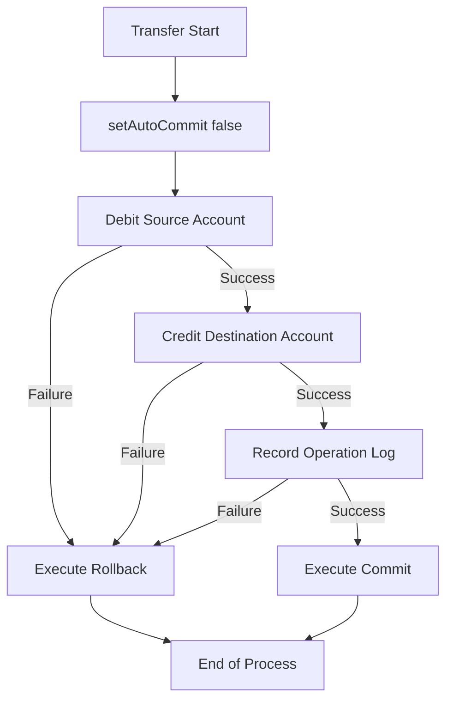

# 🏦 SalesDepartmentAPI BACK-END - Java & JDBC

This project demonstrates the implementation of a robust financial transaction system using **Java SE** and **JDBC Core**. The primary objective is to ensure data consistency in critical operations through manual control of the transaction lifecycle.

---

## 🎯 Computational Features

### 1. Transactional Integrity (ACID)
* **Manual Control:** Use of `setAutoCommit(false)` to group interdependent operations.
* **Resilience:** Execution of `commit()` only after the total success of all operational stages.
* **Automatic Rollback:** Immediate reversal of pending changes in case of any `SQLException`.

### 2. Security and Efficiency in JDBC Core
* **SQLi Protection:** Strict use of `PreparedStatement` to sanitize inputs and prevent SQL injection attacks.
* **Resource Management:** Safe handling of connection closures using `try-with-resources` blocks.

### 3. Traceability
* **History:** Structured logging of success and failure for financial operations directly to the terminal.

---

## 📐 Database Architecture

The database enforces integrity rules directly within the **PostgreSQL** engine:

```sql
CREATE TABLE accounts (
    id SERIAL PRIMARY KEY,
    name VARCHAR(100) NOT NULL,
    balance DECIMAL(10, 2) NOT NULL CHECK (balance >= 0)
);

CREATE TABLE transaction_logs (
    id SERIAL PRIMARY KEY,
    source_account INT REFERENCES accounts(id) ON DELETE CASCADE,
    destination_account INT REFERENCES accounts(id) ON DELETE CASCADE,
    amount DECIMAL(10, 2) NOT NULL,
    created_at TIMESTAMP DEFAULT CURRENT_TIMESTAMP
);
```

---

## 💻 Transaction Logical Flow

The diagram below illustrates the system behavior during a bank transfer:



---

## 🚀 How to Run the Project

### 1. Clone the Repository
```bash
git clone github.com
cd repository-name
```

### 2. Configure the Database
Access the connection configuration file (e.g., `DB.java`) and insert your local PostgreSQL credentials:
```java
private static final String URL = "jdbc:postgresql://localhost:5432/your_database";
private static final String USER = "your_username";
private static final String PASS = "your_password";
```

### 3. Compile and Run
Run the application via terminal using Maven:
```bash
mvn compile exec:java -Dexec.mainClass="your.package.Main"
```

---

## 🤝 Contributing

Ideas for the evolution of this repository:
* Implementation of different isolation levels (`Connection.TRANSACTION_SERIALIZABLE`).
* Migration of the SQL script to automated versioning with **Flyway**.
* Creation of unit tests for concurrency scenarios with **JUnit**.

---

Developed with ☕ by [Lucas Silva](https://github.com)
